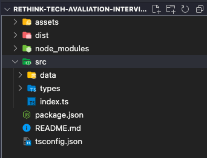
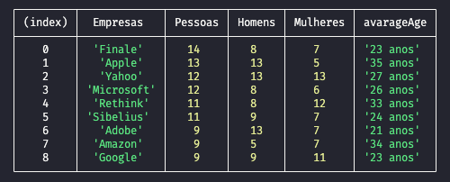

# Rethink Tech Interview

<br>

### Configurações do projeto:

- Configurar o projeto com `typescript`.
- Gerar build na pasta `./dist`.
- usar a lib `npm-run-all` e `ts-node` para limpar, buildar e rodar o script da pasta `./dist`.
- Criar branch com seu nome `test/seu-nome`.
- Usar typagem na pasta `./src/types`.
- Commitar somente o resultado final.
- Apresentar resultado usando `console.table()`.

**Estrutura**



### Dado um array de pessoas:

`TypeFakePeople[]`

```
export type TypeFakePeople = {
  email: string;
  salary: string;
  title: string;
  full_name: string;
  company: string;
  birthday: string; LL/dd/y
  gender: string
};
```

`source: "./data/index.ts"`

<br>

**Gostariamos de extrair as seguintes informações:**

- Número de pessoas que trabalham na mesma empresa.
- Ordenar de forma crescente.
- Número Total de empresas.
- Número Total de de Homens e Mulheres por empresa.
- Média de idade por empresa.

```
const groupBy = (data: TypeFakePeople[], propriedade: string) => {
  // your code here.
}

ex:
groupBy(fakeData, "company")
```

_**Entrega final**:_ Esperamos algo parecido com a tabela abaixo.


